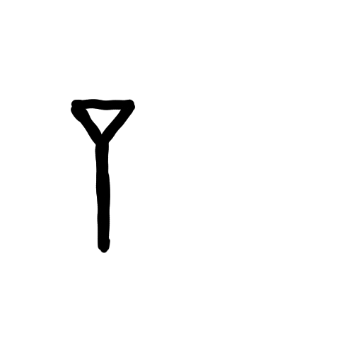
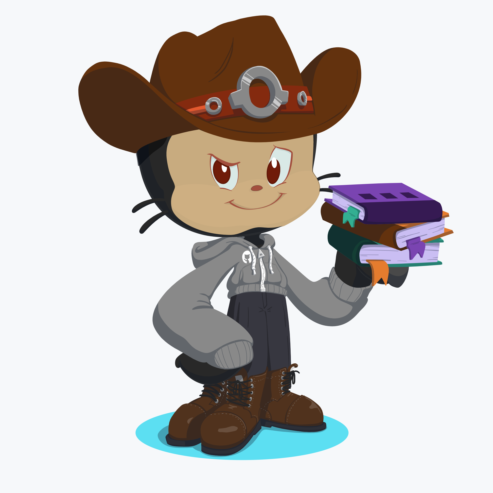

<h3> Olá, eu sou Ismael Ithalo (｡•̀ᴗ-)✧ </h3>

<!--img align='right' src="src/img/network.gif" width="230">

<!--p><em>Computer Engineering student at <a href="http://www.unb.br">University of Brasilia</a> </br-->
<!-- (｡•̀ᴗ-)✧
**ismaelithalo/ismaelithalo** is a ✨ _special_ ✨ repository because its `README.md` (this file) appears on your GitHub profile.

Here are some ideas to get you started:

- 🔭 I’m currently working on ...
- 🌱 I’m currently learning ...
- 👯 I’m looking to collaborate on ...
- 🤔 I’m looking for help with ...
- 💬 Ask me about ...
- 📫 How to reach me: ...
- 😄 Pronouns: ...
- ⚡ Fun fact: ...
-->
